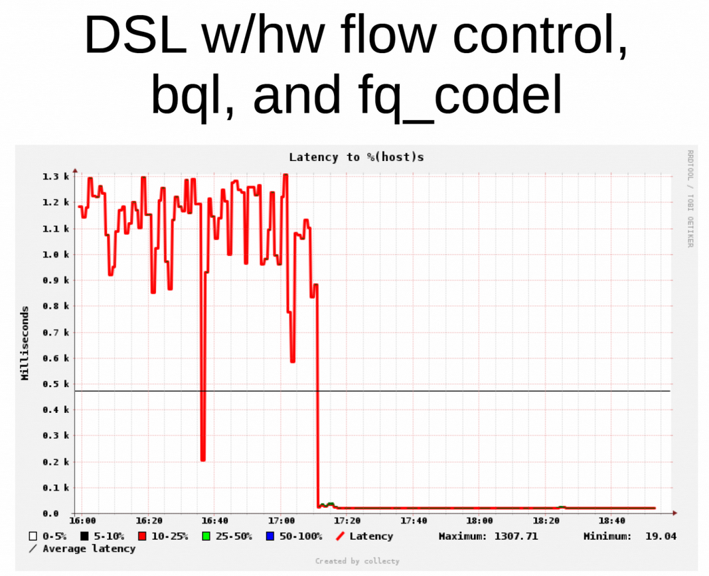
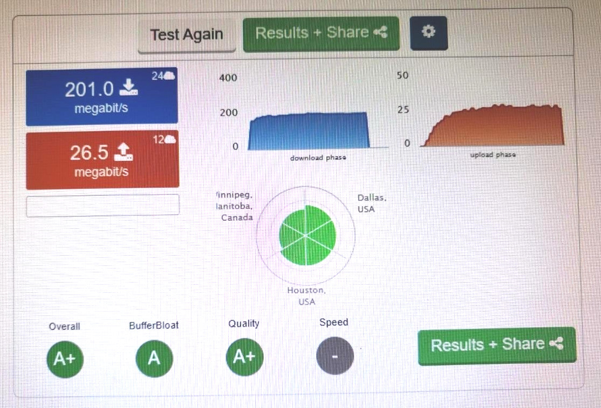

# LibreQoS

LibreQoS is an application that allows you to apply fq_codel traffic shaping to hundreds of customers. <a href="https://www.bufferbloat.net/projects/codel/wiki/">Fq_codel</a> is a Free and Open Source Active Queue Management algorithm that reduces bufferbloat, and can improve the quality of customer connections significantly. LibreQoS works with both IPv4 and IPv6. It apples hundreds of filter rules to direct customer traffic through individual fq_codel instances within an <a href="https://linux.die.net/man/8/tc-htb">HTB</a> (HTB+fq_codel). By utilizing <a href="https://tldp.org/HOWTO/Adv-Routing-HOWTO/lartc.adv-filter.hashing.html">hashing filters</a>, thousands of rules can be applied with minimal impact on traffic throughput or CPU use. This is alpha software, please do not deploy in production without thorough testing.
## How does fq_codel work?
Fq_codel distinguishes interactive flows of traffic (web browsing, audio streaming, VoIP, gaming) from bulk traffic (streaming video services, software updates). Interactive flows are prioritized to optimize their performance, while bulk traffic gets steady throughput and variable latency. The general reduction of connection latency offered by fq_codel is highly beneficial to end-users.



The impact of fq_codel on a DSL connection — a 100x latency reduction.
>“FQ_Codel provides great isolation... if you've got low-rate videoconferencing and low rate web traffic they never get dropped. A lot of issues with IW10 go away, because all the other traffic sees is the front of the queue. You don't know how big its window is, but you don't care because you are not affected by it. FQ_Codel increases utilization across your entire networking fabric, especially for bidirectional traffic... If we're sticking code into boxes to deploy codel, don't do that. Deploy fq_codel. It's just an across the board win.”
> - Van Jacobson | IETF 84 Talk
## Features
* Dual stack: client can be shaped by same qdisc for both IPv4 and IPv6
* Up to 2000 IPv4 clients or up to 1000 dual stack clients
* HTB + fq_codel
* Experimental support for CAKE (Common Applications Kept Enhanced)
* TC filters divided into groups with hashing filters to significantly increase efficiency and minimize resource use
   * VM running LibreQoS with 1000 client rules uses just 250MB RAM on average
* Simple client management through csv file
## Limitations
* Linux tc hash tables can only handle ~4000 rules each. This limits total possible clients to 2000 single-protocol clients (IPv4 only / IPv6 only) or 1000 dual stack clients. Eventually we will rework the code to allow for more clients by linking to hash tables.
## Requirements
* Edge and Core routers with MTU 1500 on links between them
   * If you use MPLS, you would terminate MPLS traffic at the core router. LibreQoS cannot decapsulate MPLS on its own.
* OSPF primary link (low cost) through the server running LibreQoS
* OSPF backup link

### Server Requirements
* VM or physical server
* One management network interface, completely seperate from the traffic shaping interface NIC. Can be NATed behind motherboard Gigabit Ethernet, that's fine.
* Network interface NIC supporting two virtual interfaces for traffic shaping (in/out), preferably SFP+ capable
  * <a href="https://www.fs.com/products/75600.html">Intel X710</a> recommended for anything over 1Gbps.
* Python 3
  * python3 -m pip install ipaddress schedule
  * If running as service:
   * sudo python3 -m pip install ipaddress schedule
* Recent Linux kernel for up-to-date linux tc package. Ubuntu Server 20.04.1+ recommended
### VM Performance
#### Memory use
On ProxMox VMs you need to do <a href="https://www.reddit.com/r/Proxmox/comments/asakcb/problem_with_ram_cache/">some tweaks</a>  to allow freed up memory to be reclaimed by the hypervisor.
#### Enable Offloading in Guest VM
Performance can greatly benefit from enabling certrain hardware offloading inside the guest VM. If you're using a system that uses Netplan (e.g. Ubuntu) to configure the network then you can use a Netplan post-up script to configure offloading. You create a script in the following directory with a name prefixed by a number to indicate load order e.g. /usr/lib/networkd-dispatcher/routable.d/10-enable-offloading - which is executable and owned by root. e.g.
```
#!/bin/sh
ethtool --offload [interfaceA] rx on tx on gso on tso on lro on sg on gro on
ethtool --offload [interfaceB] rx on tx on gso on tso on lro on sg on gro on
```
### Add a bridge between in/out interfaces
* Add linux interface bridge br0 to the two dedicated interfaces
    * For example on Ubuntu Server 20.04 which uses NetPlan, you would add the following to the .yaml file in /etc/netplan/
```
bridges:
    br0:
      interfaces:
           - eth4
           - eth5
```
## Run LibreQoS
Cd to your preferred directory and download the latest release
```
git clone https://github.com/rchac/LibreQoS.git
```
* Modify setting parameters in ispConfig.py to suit your environment
* Run:
```
sudo python3 ./LibreQoS.py
```
## Running as a service
You can use the scheduled.py file to set the time of day you want the shapers to be refreshed at after the initial run.
On linux distributions that use systemd, such as Ubuntu, add the following to /etc/systemd/system/LibreQoS.service
```
[Unit]
After=network.service

[Service]
WorkingDirectory=/home/$USER/LibreQoSDirectory
ExecStart=/usr/bin/python3 /home/$USER/LibreQoSDirectory/scheduled.py
Restart=always

[Install]
WantedBy=default.target
```
Then run
```
sudo systemctl start LibreQoS.service
```
## Memory use
Generally memory use should be under 2GB. If for any reason memory exceeds that, please make sure memory ballooning is enabled on VM host, and try
```
sudo sh -c 'echo 1 >/proc/sys/vm/drop_caches'
```
## Real World Performance
This customer is using a Ubiquiti LTU-LR CPE with QoS shaping applied at 215Mbps down and 30Mbps up.



## Server Spec Recommendations
* For up to 1Gbps
    * 4+ CPU cores
    * 4GB RAM
    * 32GB Disk Space
    * Passmark score of 13,000 or more (AMD Ryzen 5 2600 or better)
* For up to 2Gbps
    * 6+ CPU cores
    * 4GB RAM
    * 32GB Disk Space
    * Passmark score of 17,000 or more (AMD Ryzen 5 3600 or better)
* For up to 5Gbps
    * 8+ CPU cores
    * 6GB RAM
    * 32GB Disk Space
    * Passmark score of 23,000 or more (AMD Ryzen 7 3800X or better)
* For up to 10Gbps
    * 16+ CPU cores
    * 8GB RAM
    * 32GB Disk Space
    * Passmark score of 38,000 or more (AMD Ryzen 9 3950X or better)

https://www.cpubenchmark.net/high_end_cpus.html

## Special Thanks
Thank you to the hundreds of contributors to the fq_codel and cake projects, especially Dave Taht. Thank you to Phil Sutter, Bert Hubert, Gregory Maxwell, Remco van Mook, Martijn van Oosterhout, Paul B Schroeder, and Jasper Spaans for contributing to the guides and documentation listed below.

## References
* https://tldp.org/HOWTO/Adv-Routing-HOWTO/lartc.adv-filter.hashing.html
* http://linux-ip.net/gl/tc-filters/tc-filters.html
* http://linux-tc-notes.sourceforge.net/tc/doc/cls_u32.txt
* https://stackoverflow.com/questions/21454155/linux-tc-u32-filters-strange-error

## License
Copyright (C) 2020-2021 Robert Chacón

LibreQoS is free software: you can redistribute it and/or modify
it under the terms of the GNU General Public License as published by
the Free Software Foundation, either version 2 of the License, or
(at your option) any later version.

LibreQoS is distributed in the hope that it will be useful,
but WITHOUT ANY WARRANTY; without even the implied warranty of
MERCHANTABILITY or FITNESS FOR A PARTICULAR PURPOSE.  See the
GNU General Public License for more details.

You should have received a copy of the GNU General Public License
along with LibreQoS.  If not, see <http://www.gnu.org/licenses/>.
