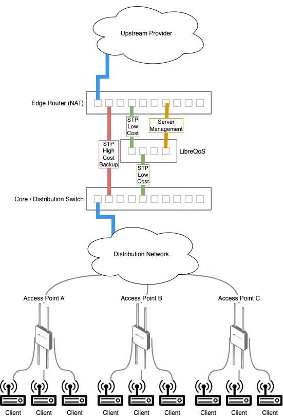

# Supuestos de Diseño de Red

## Configuraciones oficialmente soportadas  

- LibreQoS se ubica dentro de una red, generalmente entre un enrutador de borde (NAT, firewall) y un enrutador central (distribución a sitios a través de la red).
  - Si usa NAT/CG-NAT, coloque LibreQoS en lpínea al sur de donde se aplica NAT, debido a que  LibreQoS necesita dar formar a direcciones internas (100.64.0.0/12), no a IP públicas posteriores a NAT.
- - Los enrutadores de borde y de núcleo deben tener 1500 MTU en los enlaces entre ellos
- Si usa MPLS, debería terminar el tráfico MPLS en el enrutador principal. LibreQoS no puede desencapsular MPLS por sí solo.
- Enlace principal OSPF (bajo costo) a través del servidor que ejecuta LibreQoS
- Enlace de respaldo OSPF (alto costo, quizás 200 por ejemplo)


## Configuración del banco de pruebas
Cuando pruebe LibreQoS por primera vez,  recomendamos implementar un banco de pruebas a pequeña escala para verlo en acción.


### Tarjeta de Interfaz de Red

```{note}
Debe tener algouno de estos:
- Una sola NIC con dos interfaces,
- dos NIC con una sola interfaz,
- Interfaz 2x VLANs interface (utilizando una o dos NIC).
```

LibreQoS requiere que las tarjetas de red (NIC) tengan dos o más colas RX/TX y compatibilidad con XDP. Si bien muchas tarjetas cumplen teóricamente estos requisitos, las tarjetas menos utilizadas suelen presentar errores de controlador no reportados que impiden la funcionalidad XDP y las inutilizan para nuestros propósitos. Actualmente, recomendamos las tarjetas de red (NIC) Intel x520, Intel x710 y Nvidia (ConnectX-5 o posterior). No podemos garantizar la compatibilidad con otras tarjetas.


## Configuración alternativa (no compatible oficialmente) 

Esta configuración alternativa utiliza el Protocolo de árbol de expansión (STP) para modificar la ruta de datos en caso de que el dispositivo LibreQoS esté fuera de línea por mantenimiento u otro problema.

```{note}
La mayoría de estas consideraciones se aplican a la configuración alternativa y a la configuración admitida oficialmente.```

- LibreQoS se coloca en línea en la red, generalmente entre un enrutador de borde (NAT, firewall) y un enrutador central (distribución a sitios a través de la red).
  - Si usa NAT/CG-NAT, coloque LibreQoS en línea al sur de donde se aplica NAT, ya que LibreQoS necesita dar forma a direcciones internas (100.64.0.0/12), no a IP públicas posteriores a NAT.
- El enrutador de borde y el conmutador central deben tener 1500 MTU en los enlaces entre ellos
- Si usa MPLS, debería terminar el tráfico MPLS en algún lugar al sur del conmutador central/distribuidor. LibreQoS no puede desencapsular MPLS por sí solo. 
- Enlace principal de Spanning Tree (bajo costo) a través del servidor que ejecuta LibreQoS
- Enlace de respaldo de Spanning Tree (alto costo, quizás 80 por ejemplo)

Tenga en cuenta que si utiliza enlaces con diferentes anchos de banda, por ejemplo, 10 Gbps a través de LibreQoS y 1 Gbps entre el conmutador central y el enrutador de borde, es posible que deba ser más intencional con los costos de STP.


