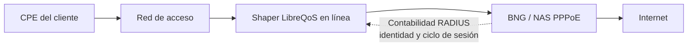
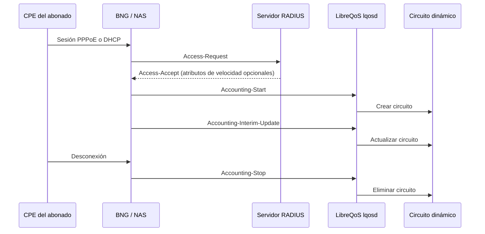
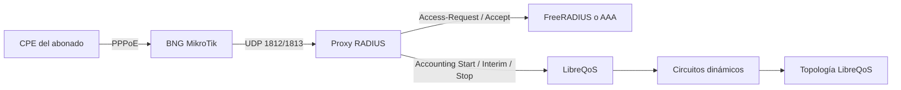

# Contabilidad RADIUS y circuitos dinámicos

LibreQoS puede recibir paquetes de contabilidad RADIUS de un BNG, NAS,
concentrador PPPoE o sistema DHCP-RADIUS y crear circuitos dinámicos para
abonados activos. Cuando un abonado recibe una dirección IP solo durante la
conexión, el circuito aparece con Accounting-Start, se actualiza con
Interim-Update y se elimina con Accounting-Stop.

La contabilidad RADIUS no sustituye la topología normal. LibreQoS todavía
necesita un nodo padre y un perfil de velocidad utilizable antes de poder dar
forma a una sesión.

## Colocar LibreQoS en la ruta de datos del abonado

RADIUS es información del plano de control, no la ruta del tráfico. Coloque
LibreQoS en línea donde pueda inspeccionar el tráfico dentro de la sesión PPPoE:
el acceso de clientes pasa por LibreQoS hasta el BNG y después a Internet. Los
paquetes Accounting indican a LibreQoS qué circuito activo de abonado es dueño
del tráfico que ya puede observar.



LibreQoS no termina PPPoE y la contabilidad RADIUS no redirige el tráfico de
clientes a través de LibreQoS. El BNG termina PPPoE; LibreQoS usa la identidad
de contabilidad para crear y eliminar el circuito de shaping correspondiente.



## Elegir la fuente de velocidad e identidad

LibreQoS admite los tres patrones siguientes. Se pueden habilitar juntos; las
velocidades decodificadas del paquete tienen prioridad sobre una fila coincidente
de `ShapedDevices.csv`, y una fila coincidente tiene prioridad sobre el perfil
de respaldo.

| Patrón | Fuente de identidad y velocidad | Uso adecuado |
| --- | --- | --- |
| Detalles completos de RADIUS | El BNG reenvía identidad y atributos de velocidad, como `Mikrotik-Rate-Limit`. | El sistema de abonados controla la velocidad. |
| Coincidencia con un dispositivo | `User-Name` o `Calling-Station-Id` coincide con el campo `MAC` de `ShapedDevices.csv`; la fila aporta circuito, nodo padre, SQM y velocidades. | Abonados PPPoE o DHCP-RADIUS ya representados en LibreQoS. |
| Valores predeterminados | Una identidad sin coincidencia usa `fallback_parent_*` y `fallback_speed_profile`. | Servicio predeterminado controlado o migración gradual. |

El arnés de prueba cubre los tres casos: una velocidad del paquete de 10/25
Mbps, una fila de usuario conocido de 60/20 Mbps y un usuario desconocido con
respaldo de 30/12 Mbps. También verifica Start, Interim-Update y Stop en cada
caso.

## Configurar LibreQoS

Habilite los circuitos dinámicos globales y defina un listener RADIUS de
clientes confiables. Restrinja cada cliente a la dirección o CIDR que envía los
paquetes Accounting—normalmente el proxy RADIUS en una topología AAA separada.
No exponga el listener a una red no confiable ni guarde el secreto compartido en
`lqos.conf`.

```toml
[dynamic_circuits]
enabled = true

[radius_accounting]
enabled = true
listen = "192.0.2.10:1813"
default_ttl_seconds = 900
stale_grace_seconds = 120

[radius_accounting.dynamic_circuit_application]
enabled = true
match_shaped_devices_by_mac = true
match_shaped_devices_by_username = true
fallback_parent_node = "BNG Access"
fallback_parent_node_id = "bng-access"
fallback_anchor_node_id = "core"

[radius_accounting.fallback_speed_profile]
download_min_mbps = 5.0
upload_min_mbps = 2.0
download_max_mbps = 30.0
upload_max_mbps = 10.0

[[radius_accounting.clients]]
name = "radius-proxy-1"
source = ["192.0.2.20/32"]
secret_file = "/etc/libreqos/radius-secrets/radius-proxy-1"
```

Guarde el archivo de secreto con permisos exclusivos del propietario y reinicie
`lqosd` después de cambiar los ajustes RADIUS o la identidad, el nodo padre, el
circuito, SQM o las velocidades en `ShapedDevices.csv`.

### Coincidir abonados PPPoE o DHCP-RADIUS

El campo `MAC` es un campo de identidad opcional. Con la coincidencia MAC
habilitada, LibreQoS normaliza los formatos MAC de `Calling-Station-Id`. Con la
coincidencia por usuario habilitada, compara `User-Name` de RADIUS literalmente
con el mismo campo. No agregue una columna de usuario separada a archivos nuevos.

```csv
Circuit ID,Circuit Name,Device ID,Device Name,Parent Node,Parent Node ID,Anchor Node ID,MAC,IPv4,IPv6,Download Min Mbps,Upload Min Mbps,Download Max Mbps,Upload Max Mbps,Comment
pppoe-42,Cliente 42,pppoe-42,Cliente 42,BNG Access,bng-access,core,customer42@example.net,,,10,5,60,20,Identidad de usuario PPPoE
```

Para DHCP-RADIUS, coloque el nombre de usuario DHCP en este campo. Para un NAS
basado en MAC, coloque allí la MAC del abonado. Una coincidencia única por
usuario tiene prioridad sobre la coincidencia MAC. Las identidades duplicadas
dejan la sesión pendiente en lugar de seleccionar un circuito arbitrario.

## Construir un BNG PPPoE MikroTik

El siguiente ejemplo de RouterOS es un esquema pequeño, no una configuración
completa de router de producción. Sustituya las interfaces, direcciones, rango
del pool, dirección del proxy y secreto por los de su red.

RouterOS envía tanto autenticación como contabilidad a la `address` de una sola
entrada `/radius add`. Cuando AAA y LibreQoS son hosts separados, apunte RouterOS
a un proxy RADIUS. El proxy reenvía el tráfico Access-Request a AAA y los
paquetes Accounting a LibreQoS. Configure LibreQoS para confiar en la dirección
de origen estable del proxy, no en la dirección del BNG.

```routeros
/ip pool add name=pppoe-subscribers ranges=100.64.0.2-100.64.255.254
/ppp profile add name=pppoe-radius local-address=100.64.0.1 remote-address=pppoe-subscribers use-encryption=no
/interface pppoe-server server add interface=ether3 service-name=internet default-profile=pppoe-radius authentication=pap one-session-per-host=yes disabled=no

/radius add service=ppp address=192.0.2.20 src-address=192.0.2.1 authentication-port=1812 accounting-port=1813 secret=replace-this-secret
/ppp aaa set use-radius=yes accounting=yes interim-update=5m
```

Permita UDP 1812 y 1813 entre el BNG y el proxy, y UDP 1813 desde el proxy hasta
LibreQoS. LibreQoS necesita paquetes de contabilidad, no paquetes Access-Request
ni Access-Accept. El proxy gestiona la relación de secreto compartido en ambos
tramos y es el cliente RADIUS incluido en `radius_accounting.clients`.



Cuando use límites de velocidad MikroTik, pruebe el mapeo de direcciones con una
captura de paquetes real o con el arnés. El arnés devuelve deliberadamente
`25M/10M` y verifica el resultado de contabilidad como 10 Mbps de descarga y 25
Mbps de subida.

## Validar antes de producción

Use el [arnés PPPoE RADIUS](../../radius-harness/README.md) incluido en un host
libvirt/KVM para probar un checkout de LibreQoS sin instalar los artefactos Rust
en el huésped. Crea VMs descartables de RouterOS, FreeRADIUS, LibreQoS y cliente
PPPoE, y las elimina con `down`.

Para un BNG de producción, verifique este ciclo de vida con un abonado de prueba:

1. Conéctelo y confirme que LibreQoS registra un Accounting-Start aceptado y
   crea un circuito dinámico con el nodo padre y las velocidades esperadas.
2. Espere un Accounting-Interim-Update y confirme que el circuito conserva el
   perfil de velocidad esperado.
3. Desconéctelo y confirme que Accounting-Stop elimina el circuito.

Si una sesión queda pendiente, revise primero la fuente del cliente confiable y
el secreto compartido; después la identidad del abonado, la dirección IP o
prefijo recibido, el nodo padre de topología y la fuente de velocidad. Consulte
la [referencia avanzada de configuración](configuration-advanced-es.md#contabilidad-radius-opcional)
para el contrato de configuración completo.
