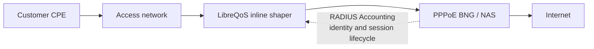
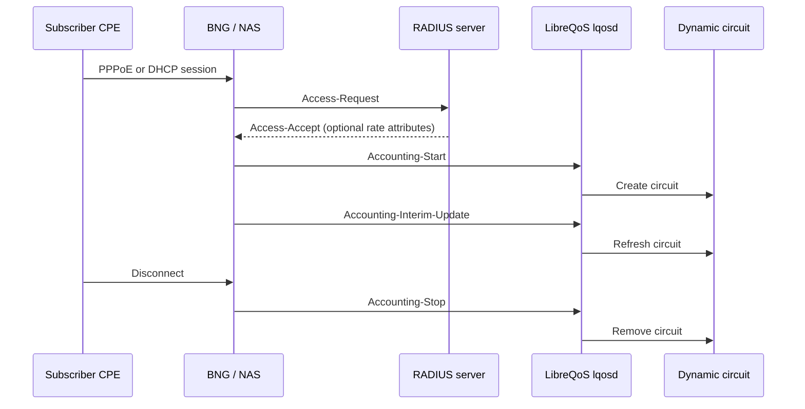

# RADIUS accounting and dynamic circuits

LibreQoS can receive RADIUS Accounting packets from a broadband network gateway
(BNG), NAS, PPPoE concentrator, or DHCP-RADIUS system and create dynamic
circuits for active subscribers. It is useful when subscribers receive an IP
address only while connected: the circuit appears at Accounting-Start, is
refreshed by Interim-Update, and is removed at Accounting-Stop.

RADIUS accounting does not replace the normal topology. LibreQoS still needs a
parent attachment and a usable speed profile before it can shape a session.

## Place LibreQoS in the subscriber data path

RADIUS is control-plane data, not the traffic path. Place LibreQoS inline where
it can inspect traffic inside the PPPoE session: customer access flows through
LibreQoS to the BNG, then to the Internet. The Accounting packets tell LibreQoS
which active subscriber circuit owns the traffic it can already observe.



LibreQoS does not terminate PPPoE and RADIUS accounting does not redirect
customer traffic through LibreQoS. The BNG terminates PPPoE; LibreQoS uses the
accounting identity to create and remove the corresponding shaping circuit.



## Choose a speed and identity source

LibreQoS supports these three deployment patterns. They can be enabled together;
packet-decoded rates take precedence over a matching `ShapedDevices.csv` row,
and a matching row takes precedence over the fallback profile.

| Pattern | Identity and speed source | Suitable use |
| --- | --- | --- |
| Full RADIUS details | The BNG forwards subscriber identity and rate attributes such as MikroTik `Mikrotik-Rate-Limit`. | The subscriber management system owns rate selection. |
| Match a shaped device | `User-Name` or `Calling-Station-Id` matches the existing `MAC` field in `ShapedDevices.csv`; the row supplies circuit, parent, SQM, and rates. | PPPoE or DHCP-RADIUS subscribers already represented in LibreQoS. |
| Defaults | An unmatched identity uses `fallback_parent_*` and `fallback_speed_profile`. | A controlled default service or gradual migration. |

The test harness exercises all three: a packet rate of 10/25 Mbps, a known
username row at 60/20 Mbps, and an unknown username with a 30/12 Mbps fallback.
It also verifies Start, Interim-Update, and Stop behavior for each case.

## Configure LibreQoS

Enable global dynamic circuits and define a trusted RADIUS listener. Restrict
each client to the source address or CIDR that sends Accounting packets—typically
the RADIUS proxy in a split AAA topology. Never expose the listener to an
untrusted network or store the shared secret directly in `lqos.conf`.

```toml
[dynamic_circuits]
enabled = true

[radius_accounting]
enabled = true
listen = "192.0.2.10:1813"
default_ttl_seconds = 900
stale_grace_seconds = 120

[radius_accounting.dynamic_circuit_application]
enabled = true
match_shaped_devices_by_mac = true
match_shaped_devices_by_username = true
fallback_parent_node = "BNG Access"
fallback_parent_node_id = "bng-access"
fallback_anchor_node_id = "core"

[radius_accounting.fallback_speed_profile]
download_min_mbps = 5.0
upload_min_mbps = 2.0
download_max_mbps = 30.0
upload_max_mbps = 10.0

[[radius_accounting.clients]]
name = "radius-proxy-1"
source = ["192.0.2.20/32"]
secret_file = "/etc/libreqos/radius-secrets/radius-proxy-1"
```

Create the secret file with owner-only permissions, then restart `lqosd` after
changing RADIUS settings or the identity, parent, circuit, SQM, or rate data in
`ShapedDevices.csv`.

### Match PPPoE or DHCP-RADIUS subscribers

The `MAC` field is an optional identity field. With MAC matching enabled,
LibreQoS normalizes `Calling-Station-Id` MAC formats. With username matching
enabled, it compares RADIUS `User-Name` to the same field verbatim. Do not add a
separate username column to new files.

```csv
Circuit ID,Circuit Name,Device ID,Device Name,Parent Node,Parent Node ID,Anchor Node ID,MAC,IPv4,IPv6,Download Min Mbps,Upload Min Mbps,Download Max Mbps,Upload Max Mbps,Comment
pppoe-42,Customer 42,pppoe-42,Customer 42,BNG Access,bng-access,core,customer42@example.net,,,10,5,60,20,PPPoE username identity
```

For a DHCP-RADIUS installation, place the DHCP username in this field instead.
For a MAC-based NAS, place the subscriber MAC there. A unique username match is
preferred before MAC matching. Duplicate identity values leave the session
pending rather than selecting an arbitrary circuit.

## Build a MikroTik PPPoE BNG

The following is a small RouterOS outline, not a complete production router
configuration. Replace interface names, addresses, pool ranges, proxy address,
and secret for your network.

RouterOS sends both authentication and accounting to the `address` in one
`/radius add` entry. When AAA and LibreQoS are separate hosts, point RouterOS at
a RADIUS proxy. The proxy forwards Access-Request traffic to AAA and forwards
Accounting packets to LibreQoS. Configure LibreQoS to trust the proxy's stable
source address, not the BNG address.

```routeros
/ip pool add name=pppoe-subscribers ranges=100.64.0.2-100.64.255.254
/ppp profile add name=pppoe-radius local-address=100.64.0.1 remote-address=pppoe-subscribers use-encryption=no
/interface pppoe-server server add interface=ether3 service-name=internet default-profile=pppoe-radius authentication=pap one-session-per-host=yes disabled=no

/radius add service=ppp address=192.0.2.20 src-address=192.0.2.1 authentication-port=1812 accounting-port=1813 secret=replace-this-secret
/ppp aaa set use-radius=yes accounting=yes interim-update=5m
```

Allow UDP 1812 and 1813 between the BNG and the proxy, and UDP 1813 from the
proxy to LibreQoS. LibreQoS needs Accounting packets, not Access-Request or
Access-Accept packets. The proxy owns the shared-secret relationship on both
legs and is the RADIUS client listed in `radius_accounting.clients`.


When using MikroTik rate limits, test the direction mapping with a real packet
capture or the harness. The harness deliberately returns `25M/10M` and verifies
the accounting result as 10 Mbps download and 25 Mbps upload.

## Validate before production

Use the committed [RADIUS PPPoE harness](../../radius-harness/README.md) on a
libvirt/KVM host to test a LibreQoS checkout without installing Rust artifacts
inside the guest. It creates disposable RouterOS, FreeRADIUS, LibreQoS, and
PPPoE-client VMs, then removes them with `down`.

For a production BNG, verify this lifecycle for one test subscriber:

1. Connect and confirm LibreQoS logs an accepted Accounting-Start and creates a
   dynamic circuit with the expected parent and rates.
2. Wait for an Accounting-Interim-Update and confirm the circuit remains with
   the expected rate profile.
3. Disconnect and confirm Accounting-Stop removes the circuit.

If a session remains pending, first check the trusted client source and shared
secret, then the subscriber identity, received IP address or prefix, topology
parent, and speed source. See the [advanced configuration reference](configuration-advanced.md#radius-accounting-optional)
for the complete configuration contract.
