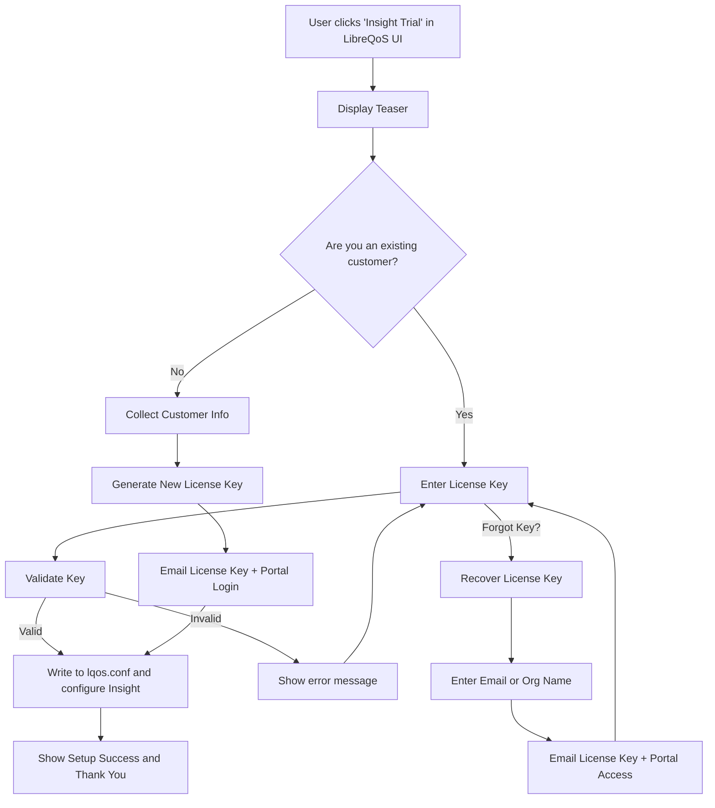

We're building the Insight sign-up system.

HTML files to work on:
* `rust/lqosd/src/node_manager/static2/lts_trial.html`

It's ok to use JavaScript. If you do, it will live in:
* `rust/lqosd/src/node_manager/js_build/src/lts_trial.js`

You can always verify compilation with the `esbuild.sh` script.

The overall process is as follows:



This process cannot all be done in LibreQoS - all of the email sending, license generation, data
storage (etc.) are handled by Insight (lts2). Insight is in a different repository.

The `lts_trial.html` page needs to display the teaser data with the following requirements:
* Use Bootstrap5 and FontAwesome (free) icons.
* We're using jQuery for REST calls.
* Use CSS that fits with other LibreQoS pages, including working with Day/Night modes.
* Use the `lts_trial.js` file to handle the JavaScript logic. Remember the "cache busting" technique
  to ensure the latest version is loaded. Check other HTML files for examples.

The teaser itself should be modular, so we can add image/text for feature content to highlight. IDEALLY, you should
define a schema for the teaser data to be loaded dynamically from a POST to the Insight server. The schema should be
clearly documented. Each teaser should have a title, description and an image URL. The design should be responsive
(with Bootstrap) and work well on mobile devices as well as desktops.

Please *also* come up with a 3-item placeholder teaser that we can use for testing purposes. Use comments
to make it clear where we will load the teaser data from the Insight server instead of using static test data.

The page itself should:

* Be a fragment so that the `template.rs` system can load it.
* Display the teaser as a "jumbotron" or similar style panel.
* Every teaser page should have two buttons:
  * "I have a license key" - which will show the license key input form.
  * "I want to try Insight for free" - which will show the customer info capture form.
  * Both buttons should be styled with Bootstrap and use FontAwesome icons.

For bonus points, use the existing dashboard API to find out how many active circuits the user has, and
display that information - at a cost of $0.30 per circuit per month, this is a great deal!

The "configure LibreQOS" step should be left as a placeholder, invoking a Rust function
in `lqosd` that will configure `lqos.conf` and restart the service. 
This will be implemented later.

## API Endpoints

The following API endpoints are used in the `lts_trial.html` page:

(Note that none of these are live yet, but will be implemented in the Insight server.)

### License Key Validation

`POST https://insight.libreqos.com/signup-api/validateLicense`
Parameters: JSON
```json
{
  "licenseKey": "your-license-key"
}
```

Returns:
```json
{
  "valid": true,
  "message": "License key is valid."
}
```

```json
{
  "valid": false,
  "message": "Invalid license key."
}
```

### License Key Recovery

`POST https://insight.libreqos.com/signup-api/recoverLicense`

Parameters: JSON
```json
{
  "email": "email"
}
```

Returns status code 200 whether it succeeded or not, and sends email if the email is valid and
has a license key associated with it (to avoid fishing trips!)

### Customer Info Capture

`POST https://insight.libreqos.com/signup-api/signupCustomer`

Parameters: JSON
```json
{
  "nodeId": "(from lqos.conf)",
  "name": "...",
  "email": "...",
  "business_name": "...",
  "address1": "...",
  "address2": "...",
  "city": "...",
  "state": "...",
  "zip": "...",
  "country": "...",
  "phone": "...",
  "website": "..."
}
```

This will return status code 200 and a JSON body if the information was captured successfully,
and a license key issued (sent by email to the user).

```json
{
  "licenseKey": "new key"
}
```

### Teasers

`GET https://insight.libreqos.com/signup-api/teasers`

This is unimplemented, and will mirror the schema we create for this process!

### Analytics Tracking

`GET https://insight.libreqos.com/signup-api/signupPing`

A tracking pixel endpoint used for analytics funnel tracking. This is called at multiple points to track user flow:
- When user clicks "I have a license key" button: `?t=<timestamp>&type=existing`
- When user clicks "Start my free trial" button: `?t=<timestamp>&type=new`
- When user submits the signup form: `?t=<timestamp>` (no type parameter)

The request includes:
- `t`: Cache-busting timestamp to ensure each ping is unique
- `type` (optional): Indicates which path the user chose ("existing" or "new")

No response body is expected - this is purely for server-side analytics tracking to help build conversion funnels.

## Teaser Schema

The teaser system is designed to showcase Insight features dynamically. The API endpoint returns a JSON response with the following schema:

```json
{
  "teasers": [
    {
      "id": "string",              // Unique identifier for the teaser
      "title": "string",            // Main headline for the feature
      "description": "string",      // Detailed description of the feature
      "imageUrl": "string",         // URL to feature image (hosted on Insight server)
                                   // Recommended image size: 800x400px (2:1 ratio)
                                   // Minimum: 600x300px, Format: JPG/PNG/WebP
                                   // Images will be displayed with letterboxing to preserve aspect ratio
      "features": [                 // Optional: Bullet points highlighting key benefits
        "string"
      ],
      "ctaText": "string",         // Optional: Custom call-to-action text (default: "Try Insight Free")
      "order": number              // Optional: Display order (lower numbers appear first)
    }
  ],
  "displayMode": "sequential"     // Display mode: "sequential" or "random"
}
```

### Example Response:
```json
{
  "teasers": [
    {
      "id": "analytics",
      "title": "Real-time Network Analytics",
      "description": "Monitor your network performance with millisecond precision. Track bandwidth usage, latency, packet loss, and more in real-time.",
      "imageUrl": "https://insight.libreqos.com/assets/analytics-dashboard.png",
      "features": [
        "Live bandwidth monitoring per circuit",
        "Historical trend analysis",
        "Automatic anomaly detection"
      ],
      "order": 1
    },
    {
      "id": "reporting",
      "title": "Advanced Reporting Suite",
      "description": "Generate comprehensive reports with just a few clicks. Perfect for management meetings and customer insights.",
      "imageUrl": "https://insight.libreqos.com/assets/reports-preview.png",
      "features": [
        "Customizable report templates",
        "Scheduled email delivery",
        "Export to PDF, CSV, or Excel"
      ],
      "ctaText": "Start Your Free Trial",
      "order": 2
    }
  ],
  "displayMode": "sequential"
}
```

The client implementation will:
- Cache teasers for 24 hours to reduce API calls
- Fall back to static placeholder teasers if the API is unavailable
- Support both sequential display (carousel) and random selection
- Ensure all teasers have consistent sizing for a polished appearance

## Validation

Please validate all fields on the client side. At an absolute minimum, we HAVE to have their
name, email, and location information (address, city, state, zip, country). We should also
make sure we don't sign-up users from countries embargoed by the US government, such as Russia, Iran, North Korea, etc.
etc.

Country lists MUST be compatible with Paddle Billing (which Insight server users). The full
list is here: https://developer.paddle.com/concepts/sell/supported-countries-locales

We absolutely mustn't change the configuration of LibreQoS until we know everything worked.

## Styling

`help.html` is a decent Bootstrap5 example we use, as is the main dashboard page. Mostly, we
want it to be clear, modern, accessible and responsive. Use existing pages for inspiration,
but please feel free to innovate and make it look great!

## Active Circuit Count

The active circuit count should be located by counting circuits in the `ShapedDevices.csv` file. There's a ssection of 
of the `lqos_config` crate that can be used to read this file and count the active circuits. We may have
to add a new API endpoint to the `lqosd` service to expose this information, but it should be straightforward.

Make this a lower priority, towards the end of this process, as it is not critical to the sign-up flow.

