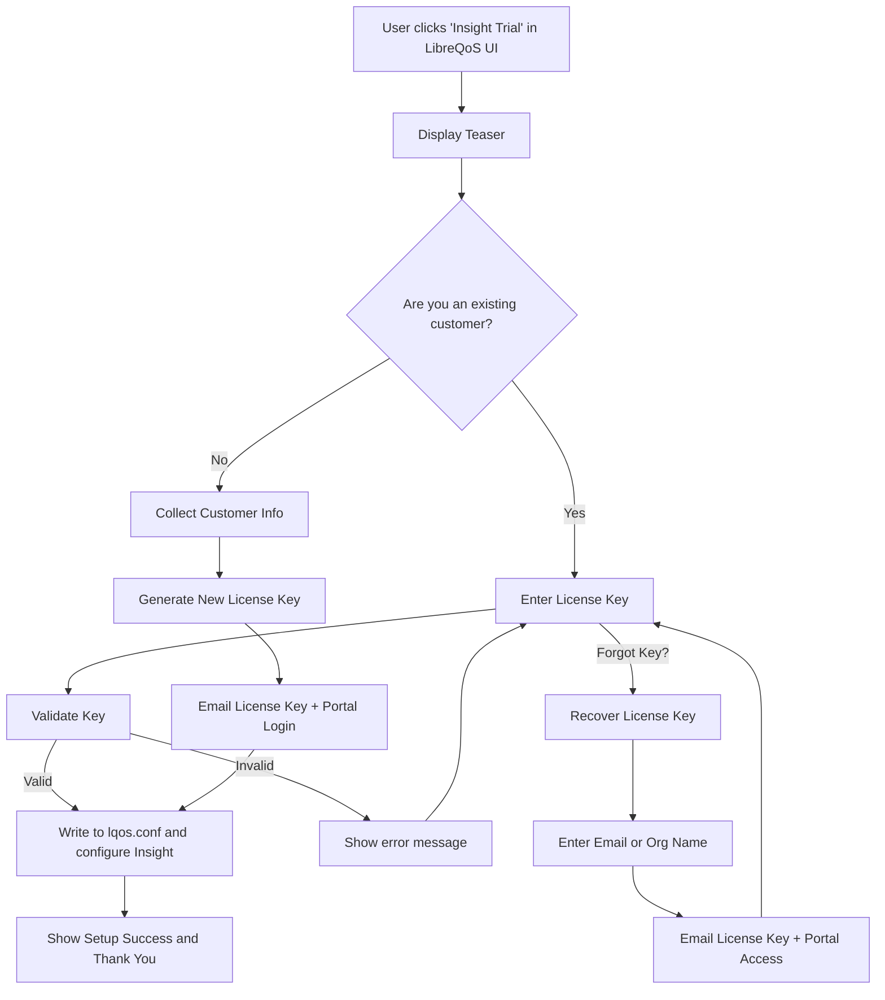

# Insight Signup Server Implementation Plan

This document describes the server-side implementation for the LibreQoS Insight signup API endpoints. The server will be implemented using FastAPI (Python web framework) and will integrate with existing databases.

The overall process (including from the LibreQoS client side) is as follows:

The overall process is as follows:



## Overview

The Insight signup server provides API endpoints for:
- License key validation and recovery
- New customer registration
- Teaser content delivery
- Analytics tracking

## Overall Design

* The project must be in Python.
* Ideally using FastAPI for the server implementation.
* There must be a clear `venv` setup with requirements etc.
* There must be a Dockerfile setup, see the `python/paddle_webhooks` project for an example.
* There must be clear integration into the Docker Compose setup (in `remote_setup/services/insight`).

## Technology Stack

- **Framework**: FastAPI (Python)
- **Database**: TBD (PostgreSQL/MySQL - to be integrated with existing Insight infrastructure)
- **Email Service**: Use the existing `mailer_svc` NATS service for sending emails
- **Authentication**: API endpoints are public (no auth required for signup flow). I don't really like this, but I don't see a way to lock this down?

## Teaser Storage

The teasers should be stored as a JSON file that can be loaded dynamically. The schema is further down in this
document. The docker compose setup should explose this as a directory, so that the server can read the file -
and we can edit it as needed without redeploying the server. There's no need to complicate this with a database.

### Static Images

"Teaser" entries can include a static image URL. This should point to `/signup-api/image?id=teaser-id` and log
that the image was loaded for analytics purposes. The server should serve these images from a static directory.
The images should be exposed as a directory via the Docker Compose setup, so they can be easily updated without redeploying the server.

## Email Templates

There are several items that send email. The `mailer_svc` NATS service will handle sending the emails. It has
a handlebars templating system and allows for complex HTML templates as well as plain text. We'll need to
expand our plan to include all of the appropriate email templates. A bonus would be to store these in a docker-compose
exposed directory, so that we can edit them without redeploying the server.

## API Endpoints

### 1. Validate License Key

**Endpoint**: `POST /signup-api/validateLicense`

**Purpose**: Validates an existing license key

**Request Body**:
```json
{
  "licenseKey": "XXXX-XXXX-XXXX-XXXX"
}
```

**Response (Success - 200)**:
```json
{
  "valid": true,
  "message": "License key is valid."
}
```

**Response (Invalid - 200)**:
```json
{
  "valid": false,
  "message": "Invalid license key."
}
```

**Implementation Notes**:
- License key format: 4 groups of 4 alphanumeric characters, separated by hyphens (always a valid v4 UUID)
- Case-insensitive validation
- Check against database of issued license keys
- Log validation attempts for security monitoring

---

### 2. Recover License Key

**Endpoint**: `POST /signup-api/recoverLicense`

**Purpose**: Sends license key recovery email to registered email addresses

**Request Body**:
```json
{
  "email": "user@example.com"
}
```

**Response (Always 200)**:
```json
{
  "status": "ok"
}
```

**Implementation Notes**:
- ALWAYS return 200 OK to prevent email fishing
- If email exists in database:
  - Send email with all license keys associated with that email
  - Include portal login link
- If email doesn't exist: do nothing
- Rate limit: Max 3 requests per email per hour
- Log all recovery attempts

**Email Template**:
```
Subject: Your LibreQoS Insight License Key(s)

Hello,

You requested your LibreQoS Insight license key(s). Here are all licenses associated with your email:

License Key: XXXX-XXXX-XXXX-XXXX
Organization: [Org Name]
Status: [Active/Expired]

You can access the Insight portal at: https://insight.libreqos.com/portal

If you didn't request this email, please ignore it.

Best regards,
LibreQoS Team
```

---

### 3. Register New Customer

**Endpoint**: `POST /signup-api/signupCustomer`

**Purpose**: Creates new customer account and issues trial license

**Request Body**:
```json
{
  "nodeId": "node-uuid-from-lqos-conf",
  "name": "John Doe",
  "email": "john@example.com",
  "business_name": "Example ISP",
  "address1": "123 Main St",
  "address2": "Suite 100",
  "city": "Anytown",
  "state": "CA",
  "zip": "12345",
  "country": "us",
  "phone": "+1-555-123-4567",
  "website": "https://example.com"
}
```

**Required Fields**: nodeId, name, email, business_name, address1, city, state, zip, country, phone

**Response (Success - 200)**:
```json
{
  "licenseKey": "XXXX-XXXX-XXXX-XXXX"
}
```

**Response (Error - 400)**:
```json
{
  "error": "Invalid country code"
}
```

**Implementation Notes**:
- Validate all required fields
- Country must be in allowed list (exclude embargoed countries)
- Email must be unique (one license per email)
- Generate unique license key
- Create customer record in database
- Send welcome email with license key and portal credentials
- Create trial subscription (30 days)
- Log signup for analytics

**Welcome Email Template**:
```
Subject: Welcome to LibreQoS Insight - Your Trial Has Started!

Hello [Name],

Welcome to LibreQoS Insight! Your 30-day trial has been activated.

Your License Key: XXXX-XXXX-XXXX-XXXX

Portal Access:
URL: https://insight.libreqos.com/portal
Email: [email]
Password: [temporary password]

Your trial includes:
- Real-time network analytics
- Advanced reporting suite
- Proactive alerts
- Full API access

Getting Started:
1. Your LibreQoS system should now be connected to Insight
2. Log into the portal to view your network analytics
3. Check out our documentation at https://docs.libreqos.com/insight

Questions? Reply to this email or visit our support portal.

Best regards,
LibreQoS Team
```

---

### 4. Get Teaser Content

**Endpoint**: `GET /signup-api/teasers`

**Purpose**: Returns dynamic teaser content for the signup page

**Response (Success - 200)**:
```json
{
  "teasers": [
    {
      "id": "analytics",
      "title": "Real-time Network Analytics",
      "description": "Monitor your network performance with millisecond precision. Track bandwidth usage, latency, packet loss, and more in real-time.",
      "imageUrl": "https://insight.libreqos.com/assets/analytics-dashboard.png",
      "features": [
        "Live bandwidth monitoring per circuit",
        "Historical trend analysis",
        "Automatic anomaly detection"
      ],
      "ctaText": "Try Insight Free",
      "order": 1
    },
    {
      "id": "reporting",
      "title": "Advanced Reporting Suite",
      "description": "Generate comprehensive reports with just a few clicks. Perfect for management meetings and customer insights.",
      "imageUrl": "https://insight.libreqos.com/assets/reports-preview.png",
      "features": [
        "Customizable report templates",
        "Scheduled email delivery",
        "Export to PDF, CSV, or Excel"
      ],
      "ctaText": "Start Your Free Trial",
      "order": 2
    },
    {
      "id": "alerts",
      "title": "Proactive Alerts",
      "description": "Get notified before issues impact your customers with intelligent monitoring and predictive analytics.",
      "imageUrl": "https://insight.libreqos.com/assets/alert-system.png",
      "features": [
        "Customizable alert thresholds",
        "Multi-channel notifications",
        "Intelligent issue prediction"
      ],
      "order": 3
    }
  ],
  "displayMode": "sequential"
}
```

**Implementation Notes**:
- Cache response for 24 hours
- Images should be 800x400px (2:1 ratio)
- Can be static or dynamically generated based on A/B testing
- Consider adding more teasers for different feature sets

---

### 5. Analytics Tracking Pixel

**Endpoint**: `GET /signup-api/signupPing`

**Purpose**: Tracks user interactions for conversion funnel analytics

**Query Parameters**:
- `t`: Timestamp (for cache busting)
- `type` (optional): "existing" or "new" (indicates which path user chose)

**Examples**:
- User clicks "I have a license key": `/signup-api/signupPing?t=1703001234567&type=existing`
- User clicks "Start my free trial": `/signup-api/signupPing?t=1703001234568&type=new`
- User submits signup form: `/signup-api/signupPing?t=1703001234569`

**Response**: 1x1 transparent PNG image

**Implementation Notes**:
- Log timestamp, IP address, user agent, type
- Track conversion funnel:
  - Page views (when teaser loads)
  - Path selection (existing vs new)
  - Form submissions
- Use for marketing analytics and optimization
- Consider adding session tracking via cookies

---

## Database Schema

Existing database tables are found in the `db_setup` project, and we'd like to use them. We can make
modifications to the schema if we need to, but we should try to avoid that if possible.

## Security Considerations

1. **Rate Limiting**:
   - License validation: 10 attempts per IP per minute
   - Recovery emails: 3 per email per hour
   - Signups: 5 per IP per hour

2. **Input Validation**:
   - Sanitize all inputs
   - Validate email formats
   - Check country codes against allowed list
   - License key format validation

3. **Logging**:
   - Log all API requests
   - Monitor for suspicious patterns
   - Alert on repeated failed validations

4. **CORS**:
   - Unfortunately, people might be running shapers anywhere - so we need very relaxed CORS settings.

---

## Testing Considerations

1. **Unit Tests**:
   - Test each endpoint with valid/invalid data
   - Test rate limiting
   - Test email sending (mock SMTP)

2. **Integration Tests**:
   - Test full signup flow
   - Test database operations
   - Test email delivery

3. **Load Tests**:
   - Simulate high traffic on tracking pixel
   - Test concurrent signups
   - Verify rate limiting under load

---

## Deployment Notes

1. Use environment variables for:
   - Database credentials
   - NATS information
   - See the `remote_setup/services/insight` directory for how things are currently setup.

2. Integrate with the nginx reverse proxy - both sites (one is via Cloudflare, the other direct).
   - You can find the setup in `remote_setup/storage/nginx_conf` directory.